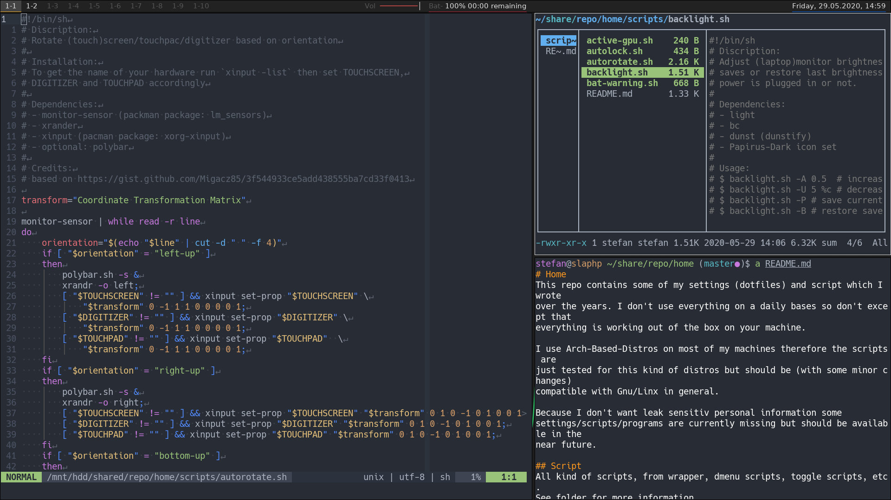

# Home
This repo contains some of my settings (dotfiles) and script which I wrote
over the years. I don't use everything on a daily bases so don't except that
everything is working out of the box on your machine.

I use Arch-Based-Distros on most of my machines therefore the scripts are
just tested for this kind of distros but should be (with some minor changes)
compatible with Gnu/Linx in general.

Because I don't want leak sensitiv personal information some
settings/scripts/programs are currently missing but should be available in the
near future.

## Desktop
Windowmanager of choice is BSPWM:

## Script
All kind of scripts, from wrapper, dmenu scripts, toggle scripts, etc.
See folder for more information.

## dotfiles
WIP

# Contribution
Any help is much appreciated. Don't be to harsh please, some of the files
were born after a long day/night.
